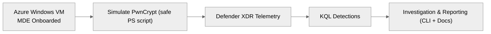

# PwnCrypt Ransomware Hunt Lab (Safe Simulation)

[](./.github/workflows/ci.yml)
[](LICENSE)
[](docs/index.md)

A hands-on **Microsoft Defender for Endpoint (MDE) & XDR** investigation lab that safely simulates a *PwnCrypt-like* ransomware incident—**without encrypting real files**. You’ll generate realistic file and process artifacts, run ready-to-use **KQL detections**, and practice investigation and reporting using provided examples and a tiny CLI.

> ⚠️ **Ethics & Safety**: This repo does **not** include real ransomware. The included PowerShell script only creates decoy files, renames them to include the `.pwncrypt` marker, and drops a ransom note—sufficient to produce detection signals. **Run only in an isolated lab VM.**

---

## TL;DR Quick Start

### 1) Clone & Set Up (host or analysis box)
```bash
git clone https://github.com/qexa/pwncrypt-ransomware-hunt-lab.git
cd pwncrypt-ransomware-hunt-lab
# Option A: using uv (recommended)
curl -LsSf https://astral.sh/uv/install.sh | sh
uv venv
uv pip install -e ".[dev]"
# Option B: plain Python
python -m venv .venv && source .venv/bin/activate  # Windows: .venv\Scripts\activate
pip install -e ".[dev]"
```

### 2) Prepare a Windows VM in Azure + Onboard to MDE
- Create a **Windows 11/10** VM in **Azure** (any size is fine for a lab).
- Onboard the VM to **Microsoft Defender for Endpoint** (MDE) using your tenant’s onboarding package.
- Verify the device appears in the Defender portal and is sending telemetry.

See **docs/setup-azure-vm.md** for a step-by-step with tips and links.

### 3) Simulate “PwnCrypt-like” Activity (on the VM)
Open **PowerShell as Administrator** on the VM and run:
```powershell
Set-ExecutionPolicy -Scope Process -ExecutionPolicy Bypass
cd C:\Users\Public
# Adjust TargetDir as desired (must be writable by your test user)
powershell -File "C:\path\to\repo\lab\simulate_pwncrypt.ps1" -TargetDir "C:\Users\Public\PwnCryptLab"
```
This will:
- Copy a couple of benign sample files,
- Rename them to include `.pwncrypt` in the filename (e.g., `hello.pwncrypt.txt`),
- Drop a ransom note `README_PWNCRYPT.txt`.

> **Do not** use untrusted scripts from the internet that claim to be “training ransomware” unless you fully trust and have reviewed the code. This lab’s script is transparent and intentionally safe.

### 4) Hunt with KQL in Defender (copy/paste ready)
Open the **Microsoft Defender** portal and use the queries in `detections/*.kql`, e.g.:

```kusto
let VMName = "YOUR-VM-NAME";
DeviceFileEvents
| where DeviceName == VMName
| where FileName contains ".pwncrypt"
| order by Timestamp desc
```

Additional queries:
- `detections/02_powershell_ransom_activity.kql`
- `detections/03_correlate_file_and_process.kql`
- `detections/04_timeline_around_event.kql`

### 5) Generate an Incident Summary (optional)
Use the tiny CLI to turn example logs (or your exported results) into a Markdown summary:

```bash
python -m labreport summarize   --device YOUR-VM-NAME   --files examples/sample_DeviceFileEvents.json           examples/sample_DeviceProcessEvents.json   --out reports/incident-demo.md
```

Open the generated file and refine it with your findings.

---

## Features
- ✅ **Safe simulation** (no encryption) that still triggers realistic telemetry
- 🧪 **KQL detections** for files, processes, and timeline correlation
- 🧭 **Investigation workflow** docs with MITRE ATT&CK mapping notes
- 🧰 **Tiny CLI** to convert exported results into a shareable incident report
- 📚 **MkDocs docs** scaffold for your notes & screenshots

## Architecture

See the Mermaid file at `architecture.mmd`.

## MITRE ATT&CK (illustrative)
| Tactic | Technique | Notes |
|---|---|---|
| Execution | PowerShell (T1059.001) | Simulation script run by admin in lab |
| Impact | Data Encrypted for Impact (T1486) | **Simulated** by filename markers only |
| Discovery | Query Registry (T1012) | (Optional) Script can query version/paths |

## Compliance / Mapping
This lab is for **training** and **portfolio** use. Map your detections to MITRE as you extend it.

## Project Layout
```
pwncrypt-ransomware-hunt-lab/
├─ README.md
├─ LICENSE
├─ CHANGELOG.md
├─ SECURITY.md
├─ CONTRIBUTING.md
├─ CODE_OF_CONDUCT.md
├─ ROADMAP.md
├─ .gitignore
├─ .editorconfig
├─ .env.example
├─ architecture.mmd
├─ Makefile
├─ mkdocs.yml
├─ docs/
├─ watchlists/
├─ detections/
├─ lab/
├─ examples/
├─ src/
├─ tests/
├─ docker/
├─ .github/
└─ devcontainer.json
```

## Running the Docs Locally
```bash
make docs-serve
# Then open http://127.0.0.1:8000
```

## Development Commands
```bash
make install    # uv venv + install deps
make lint       # ruff + basic checks
make test       # pytest
make fmt        # ruff format
```

## Safety & Legal
- Use only in a **contained lab**. Never deploy to production endpoints.
- You are responsible for complying with your local laws and organizational policies.
- This repository ships **no malware**; it only creates decoy artifacts.

---

### Credits
Inspired by community blue-team labs and the need for safe ransomware detection practice. Authored by **Qexa Labs** contributors.
